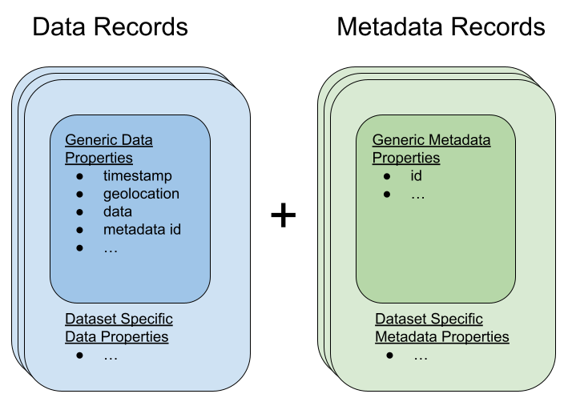

.. _schema:

Argovis data schema
===================
All data indexed by Argovis follows the schema described in this document. The purpose of this schema is to standardize the representation of profile-, grid-, and sea surface-type datasets to promote their interoperability and underwrite a standardized API to serve them all.

.. admonition:: The Last Word

   In the event of conflicts in schema definition, the implementation at `https://github.com/argovis/db-schema <https://github.com/argovis/db-schema>`_ is to be taken as correct above all others.

A heritable generic schema
--------------------------

Argovis schema are designed to inherited from a semi-well-defined generic schema that structures the most universal aspects of earth system data in a regular fashion, thereby standardizing the commonalities between these dataset representations, while preserving the ability for individual datasets to represent unique data. All datasets in Argovis are thus represented by a pair of collections, one for data, and one for metadata, where the dataset-specific records in each inherit from the generic data and metadata schemas respectively. This can be visualized as per:



In other words, *all* data records for *all* datasets include the fields defined below in the generic data record section, and similarly for metadata records. Each dataset can append additional fields to each to capture their specifics; each dataset supported by Argovis has its extension specifics detailed in subsequent sections of this document.

How to read this schema
+++++++++++++++++++++++

Each entry in the schema fragments below contain a few keys:

- **required:** whether or not this attribute can be omitted; "case" indicates case-by-case decisions for different datasets
- **type:** the primitive type,  format,  or object description of a valid entry for this field
- **description:** short comment on what this variable is
- **fill value** (optional): what this should be filled by if absent
- **current vocabulary** (optional): current set of possible values for this key,  with explanations as required.

.. admonition:: Database versus API

   The schema described here are as they appear in our database. Depending on filtering and transform flags used, Argovis' API may add or remove fields to suit the user's request; this behvior is discussed in detail in the API docs.

Schema enforcement & population
+++++++++++++++++++++++++++++++

Argovis uses MongoDB as its backend. All datasets have their data and metadata schema defined in `https://github.com/argovis/db-schema <https://github.com/argovis/db-schema>`_, which includes enforcement of these schema when uploaded to mongodb; therefore, the schema implementation in that code should be considered the most reliable document of our schema.

Generic Point Schema
--------------------

As noted above, generic schema form the basis of all schema in Argovis; this section describes the minimum viable information needed to populate these schema for our point-like datasets, including in-situ measurements and most gridded products. Subsequent sections describe how specific datasets extend and implement these core definitions.

Generic Point Data Schema
+++++++++++++++++++++++++

In general, data records are intended to represent data that is unique or frequently changing per longitude / latitude / timestamp triple, in order to support efficient temporospatial indexing of these records in Mongodb. All data records contain the following fields:


- ``_id``

  - **required:** true
  - **type:** string
  - **description:** unique record identifier that encodes something meaningful, such as measurement order per platform.

- ``metadata``

  - **required:** true
  - **type:** array
  - **description:** foreign key(s) that matches the ``_id`` of the corresponding metadata record. Preferentially chosen to encode something physically meaningful that corresponds to metadata groupings, like Argo platform ID. If array references exactly one metadata document, then that metadata doc applies to all values in ``data_info[0]`` for this data document; if ``metadata`` lists more than one element, they are to be interpreted as per-item in ``data_info[0]`` (ie, ``metadata[i]`` is the metadata corresponding to ``data_info[0][i]``).

- ``geolocation``

  - **required:** true
  - **type:** geojson Point object
  - **description:** geojson Point tagging the lon/lat of this record.
  - **fill value:** ``{"type": "Point",  "coordinates": [0,  -90]}``

- ``basin``

  - **required:** case
  - **type:** int
  - **description:** integer index of basin.
  - **fill value:** -1,  used if reported lon/lat are not associated with a basin (possibly on land) according to our basin index raster.

- ``timestamp``

  - **required:** case
  - **type:** ISO 8601 UTC datestring,  example ``1999-12-31T23:59:59Z``
  - **description:** time the record measurement was made at.
  - **fill_value:** ``9999-01-01T00:00:00Z``

- ``data``

  - **required:** true in MongoDB; may be filtered out in API on request.
  - **type:** array of arrays of floats, ints, strings and / or nulls
  - **description:** a matrix of per-level measurements and flags, where ``data[i][j]`` represents the ith variable as ordered by ``data_info[0]``, at the jth depth or pressure level.

Generic Point Metadata Schema
+++++++++++++++++++++++++++++

In general, metadata records in Argovis are meant to factor out constant or infrequently-changing data from the data records. They only have one required field:

- ``_id``

  - **required:** true
  - **type:** string
  - **description:** unique record identifier referred to by the ``metadata`` field in records from the corresponding data collection.

Besides the trivially required ``_id`` field, there are a set of generic metadata fields, presented in this section, that may, if required or desired, appear in the metadata or data schemas for a given dataset, depending on which choice provides the most efficient encoding for that dataset. Each dataset specified below includes the division of these fields between data and metadata.

- ``data_info``

  - **required:** true
  - **type:** array of arrays of floats, ints, strings and / or nulls
  - **description:** 

    - ``data_info[0]``: array of strings naming the measurements, estimates or flags, in order, found in ``data``.
    - ``data_info[1]``: array of strings naming per-variable metadata items (commonly things like units or long descriptions)
    - ``data_info[2]``: matrix of per-variable metadata, with rows labeled by ``data_info[0]`` and columns labeled by ``data_info[1]``.

- ``data_type``

  - **required:** true
  - **type:** string
  - **description:** token indicating the general class of data
  - **current vocabulary:** ``oceanicProfile``,  ``tropicalCyclone``, ``drifter``, and ``argo_trajectory`` for point-like data, and ``temperature``, ``salinity``, ``ocean_heat_content`` and ``covariance`` for grids.

- ``date_updated_argovis``

  - **required:** true
  - **type:** ISO 8601 UTC datestring,  example ``1999-12-31T23:59:59Z``
  - **description:** time the record was added to Argovis; applies to both metadata records and corresponding data records.

- ``source``

  - **required**: true (insofar as some of its subkeys, below, are required)
  - **type**: array of objects
  - **description**: objects contain information about the upstream files from which this data / metadata was derived; see immediately below for keys of these objects.

- ``source.source``

  - **required:** true
  - **type:** array of strings
  - **description:** data origin, typically used to label major project subdivisions like ``argo_core``, ``argo_bgc`` and ``argo_deep``.

- ``source.url``

  - **required:** false
  - **type:** string
  - **description:** url from where the original data file from which this data and metadata was extracted can be downloaded from.

- ``source.doi``

  - **required:** false
  - **type:** string
  - **description:** DOI for this file.

- ``source.date_updated``

  - **required:** false
  - **type:** ISO 8601 UTC datestring,  example ``1999-12-31T23:59:59Z``
  - **description:** date and time the upstream source file for this record was last modified.

- ``country``

  - **required:** false
  - **type:** string
  - **description:** ISO 3166-1 country code.

- ``data_center``

  - **required:** false
  - **type:** string
  - **description:** entity responsible for processing this record, once received.

- ``data_warning``

  - **required:** false
  - **type:** array of strings
  - **description:** short string tokens indicating possible problems with this record.
  - **current vocabulary:**
  
    - ``degenerate_levels``: data is reported twice for a given pressure / altitude level in a way that cannot be readily resolved
    - ``missing_basin``: unable to determine meaningful basin code, despite having a meaningful lat / lon (edge case in basins lookup grid)
    - ``missing_location``: one or both of longitude and latitude are missing
    - ``missing_timestamp``: no date or time of measurement associated with this profile.

- ``instrument``

  - **required:** false
  - **type:** string
  - **description:** string token describing the device used to make this measurement,  like ``profiling_float``,  ``ship_ctd`` etc.

- ``pi_name``

  - **required:** false
  - **type:** array of strings
  - **description:** name(s) of principle investigator(s).

- ``platform``

  - **required:** false
  - **type:** string
  - **description:** unique identifier for the platform or device responsible for making the measurements included in this recor, where applicable.

- ``platform_type``

  - **required:** false
  - **type:** string
  - **description:** make or model of the platform.

- ``levels``

  - **required:** case
  - **type:** array of floats
  - **description:** Pressure or depth levels corresponding by index to each list of measurements in ``data``. Note this parameter only makes sense and only is used when the measurements in the data vectors fall on regular levels, such as for gridded or interpolated products. 

- ``level_units``

  - **required:** case
  - **type:** string
  - **description:** units associated with the values in the ``levels`` array, typically dbar or m.

- ``lattice``

  - **required:** case
  - **type:** object
  - **description:** describes the shape and extent of the longitude / latitude grid data has been interpolated to. All subfields are required if ``lattice`` is present.

- ``lattice.center``

  - **type:** array of two floats
  - **description:** [longitude, latitude] of a point on the grid close to [0,0].

- ``lattice.spacing``

  - **type:** array of two floats
  - **description:** [longitude stride, latitude stride] between points on the grid

- ``lattice.[min | max][Lon | Lat]``

  - **type:** float
  - **description:** [minimum | maximum] [longitude | latitude] seen in the dataset 

Argo Schema Extension
---------------------

Argovis maintains and indexes a full sync of ifremer's argo data, updated nightly. The Argo data and metadata collections extend and implement the generic schema as follows.

Argo metadata documents
+++++++++++++++++++++++

Argo metadata documents carry the following properties; any property not explained here refers to the generic metadata schema.

- ``_id``, constructed as ``<platform>_m<metadata_number>``, where ``<metadata_number>`` counts from 0 and is prefixed with ``m`` to easily distinguish it from cycle number; allows distinctions to be made if a slow-changing metadata value, like ``pi_name``, changes over the lifetime of the float.
- ``data_type``
- ``data_center``
- ``instrument``
- ``pi_name``
- ``platform``
- ``platform_type``
- ``fleetmonitoring``

  - **required:** false
  - **type:** string
  - **description:** URL for this float at https://fleetmonitoring.euro-argo.eu/float/

- ``oceanops``

  - **required:** false
  - **type:** string
  - **description:** URL for this float at https://www.ocean-ops.org/board/wa/Platform

- ``positioning_system``

  - **required:** false
  - **type:** string
  - **description:** positioning system for this float.
  - **current vocabulary**: see Argo ref table 9

- ``wmo_inst_type``

  - **required:** false
  - **type**: string
  - **description:** instrument type as indexed by Argo.
  - **current vocabulary:** see Argo ref table 8

Argo metadata example::

  {
    "_id": "3901306_m0",
    "data_type": "oceanicProfile",
    "data_center": "AO",
    "instrument": "profiling_float",
    "pi_name": [
      "GREGORY C. JOHNSON"
    ],
    "platform": "3901306",
    "platform_type": "NAVIS_A",
    "fleetmonitoring": "https://fleetmonitoring.euro-argo.eu/float/3901306",
    "oceanops": "https://www.ocean-ops.org/board/wa/Platform?ref=3901306",
    "positioning_system": "GPS",
    "wmo_inst_type": "863"
  }
  

Argo data documents
+++++++++++++++++++

Argo data documents carry the following properties; any property not explained here refers to the generic data schema.

- ``_id``, constructed as ``<platform>_<cycle_number>``
- ``metadata``
- ``geolocation``
- ``basin``, required for Argo
- ``timestamp``, required for Argo
- ``data``
- ``data_info``
- ``data_updated_argovis``
- ``source``
- ``source.source``
- ``source.url``
- ``source.date_updated``
- ``data_warning``
- ``cycle_number``

  - **required:** true
  - **type:** int
  - **description:** probe cycle index

- ``geolocation_argoqc``

  - **required:** false
  - **type:** int
  - **description:** Argo's position QC flag
  - **fill value:** -1

- ``profile_direction``

  - **required:** false
  - **type:** string
  - **description:** whether the profile was gathered as the float ascended or descended
  - **current vocabulary:** ``A`` scending or ``D`` escending.

- ``timestamp_argoqc``

  - **required:** false
  - **type:** int
  - **description:** Argo's date QC flag
  - **fill value:** -1

- ``vertical_sampling_scheme``

  - **required:** false
  - **type:** string
  - **description:** sampling scheme for this profile.
  - **current vocabulary:** see Argo ref table 16

Argo data schema example::

  {
    "_id": "3901306_196",
    "geolocation": {
      "type": "Point",
      "coordinates": [
        -128.3021,
        0.4438
      ]
    },
    "basin": 2,
    "timestamp": "2024-11-03T05:32:52.000Z",
    "date_updated_argovis": "2024-11-04T06:35:09.597Z",
    "source": [
      {
        "source": [
          "argo_core"
        ],
        "url": "ftp://ftp.ifremer.fr/ifremer/argo/dac/aoml/3901306/profiles/R3901306_196.nc",
        "date_updated": "2024-11-03T08:01:15.000Z"
      }
    ],
    "cycle_number": 196,
    "geolocation_argoqc": 1,
    "profile_direction": "A",
    "timestamp_argoqc": 1,
    "vertical_sampling_scheme": "Primary sampling: averaged",
    "data": [
      [
        4.27,
        6.07,
        ...
        1898.159912,
        1948.329956
      ],
      [
        1,
        1,
        ...
        1,
        1
      ],
      [
        33.792,
        33.764999,
        ...
        35.596699,
        35.589199
      ],
      [
        3,
        3,
        ...
        3,
        3
      ],
      [
        23.306,
        23.229,
        ...
        2.4614,
        2.3181
      ],
      [
        1,
        1,
        ...
        1,
        1
      ]
    ],
    "data_info": [
      [
        "pressure",
        "pressure_argoqc",
        "salinity",
        "salinity_argoqc",
        "temperature",
        "temperature_argoqc"
      ],
      [
        "units",
        "data_keys_mode"
      ],
      [
        [
          "decibar",
          "A"
        ],
        [
          null,
          null
        ],
        [
          "psu",
          "A"
        ],
        [
          null,
          null
        ],
        [
          "degree_Celsius",
          "A"
        ],
        [
          null,
          null
        ]
      ]
    ],
    "metadata": [
      "3901306_m0"
    ]
  }

Implementation
++++++++++++++

Implementation of Argo's schema and pipelines to load the data from ifremer can be found at the following links.

- Schema implementation and indexing: `https://github.com/argovis/db-schema/blob/main/argo.py <https://github.com/argovis/db-schema/blob/main/argo.py>`_
- Upload pipeline: `https://github.com/argovis/ifremer-sync <https://github.com/argovis/ifremer-sync>`_

CCHDO Schema Extension
----------------------

Argovis serves a selection of ship-based profiles curated by our colleagues at CCHDO. The CCHDO data and metadata collections extend and implement the generic schema as follows.

CCHDO metadata documents
++++++++++++++++++++++++

CCHDO metadata documents carry the following properties; any property not explained here refers to the generic metadata schema.

- ``_id``, constructed as ``<cchdo_cruise_id>_m<metadata_number>``,  where ``<metadata_number>``` counts from 0 and is prefixed with ``m`` similar to Argo; allows distinctions to be made if a slow-changing metadata value, like ``pi_name``, changes over the lifetime of the cruise.
- ``date_updated_argovis``
- ``data_type``
- ``country``
- ``data_center``
- ``instrument``
- ``pi_name``
- ``expocode``

  - **required:** true
  - **type:** string
  - **description:** NODC expedition code

- ``file_expocode``

  - **required:** false
  - **type:** string
  - **description:** TBD

- ``cchdo_cruise_id``

  - **required:** true
  - **type:** int
  - **description:** CCHDO cruise identifier

- ``woce_lines``

  - **required:** true
  - **type:** array of strings
  - **description:** World Ocean Circulation Experiment line identifiers

- ``positioning_system``

  - **required:** false
  - **type:** string
  - **description:** Profile positioning system used to fix geolocation.

CCHDO metadata example::

  {
    "_id": "2366_m0",
    "date_updated_argovis": "2024-08-16T21:29:31.526Z",
    "data_type": "oceanicProfile",
    "country": "45",
    "data_center": "CCHDO",
    "instrument": "ship_btl",
    "pi_name": [
      "Peter Croot"
    ],
    "expocode": "45CE20170427",
    "file_expocode": "74CE17007",
    "woce_lines": [
      "A02"
    ],
    "cchdo_cruise_id": 2366,
    "positioning_system": "GPS"
  }


CCHDO data documents
++++++++++++++++++++

CCHDO data documents carry the following properties; any property not explained here refers to the generic data schema.

- ``_id``: constructed as ``expo_<expocode>_sta_<station>_cast_<cast>``
- ``metadata``
- ``geolocation``
- ``basin``, required for CCHDO
- ``timestamp``, required for CCHDO
- ``data_warning``
- ``data``
- ``data_info``
- ``source``
- ``source.source``
- ``source.url``
- ``source.cruise_url``

  - **required:** false
  - **type:** string
  - **description:** TBD

- ``source.file_name``

  - **required:** false
  - **type:** string
  - **description:** TBD
  

- ``btm_depth``

  - **required:** false
  - **type:** float
  - **description:** bottom depth at the location of the profile

- ``file_hash``

  - **required:** false
  - **type:** string
  - **description:** TBD

- ``station``

  - **required:** true
  - **type:** string
  - **description:** station number

- ``cast``

  - **required:** true
  - **type:** integer
  - **description:** cast number

CCHDO data example::

  {
    "_id": "expo_45CE20170427_sta_012_cast_001_type_btl",
    "metadata": [
      "2366_m0"
    ],
    "geolocation": {
      "coordinates": [
        -45.647,
        42.242
      ],
      "type": "Point"
    },
    "basin": 1,
    "timestamp": "2017-05-04T00:00:00.000Z",
    "file_hash": "66bb8a4a9de915131470726211a05771242389a30f9a8f10dab396b262f53a98",
    "source": [
      {
        "source": [
          "cchdo_go-ship"
        ],
        "cruise_url": "https://cchdo.ucsd.edu/cruise/45CE20170427",
        "url": "https://cchdo.ucsd.edu/data/39157/74CE17007_bottle.nc",
        "file_name": "74CE17007_bottle.nc"
      }
    ],
    "data_info": [
      [
        "bottle_number",
        "bottle_salinity",
        "bottle_salinity_woceqc",
        "doxy_bfile",
        "doxy_bfile_woceqc",
        "salinity_bfile",
        "salinity_bfile_woceqc",
        "temperature_bfile",
        "temperature_bfile_woceqc",
        "nitrate",
        "nitrate_woceqc",
        "nitrite",
        "nitrite_nitrate",
        "nitrite_nitrate_woceqc",
        "nitrite_woceqc",
        "oxygen",
        "oxygen_woceqc",
        "phosphate",
        "phosphate_woceqc",
        "pressure",
        "sample",
        "silicate",
        "silicate_woceqc",
        "total_alkalinity",
        "total_alkalinity_woceqc",
        "total_carbon",
        "total_carbon_woceqc"
      ],
      [
        "units",
        "reference_scale",
        "data_keys_mapping",
        "data_source_standard_names",
        "data_source_units",
        "data_source_reference_scale"
      ],
      [
        [
          null,
          null,
          "bottle_number",
          null,
          null,
          null
        ],
        [
          "psu",
          "PSS-78",
          "bottle_salinity",
          "sea_water_practical_salinity",
          "1",
          "PSS-78"
        ],
        [
          null,
          null,
          "bottle_salinity_qc",
          "status_flag",
          null,
          null
        ],
        [
          "micromole/kg",
          null,
          "ctd_oxygen",
          "moles_of_oxygen_per_unit_mass_in_sea_water",
          "umol/kg",
          null
        ],
        [
          null,
          null,
          "ctd_oxygen_qc",
          "status_flag",
          null,
          null
        ],
        [
          "psu",
          "PSS-78",
          "ctd_salinity",
          "sea_water_practical_salinity",
          "1",
          "PSS-78"
        ],
        [
          null,
          null,
          "ctd_salinity_qc",
          "status_flag",
          null,
          null
        ],
        [
          "Celsius",
          "ITS-90",
          "ctd_temperature",
          "sea_water_temperature",
          "degC",
          "ITS-90"
        ],
        [
          null,
          null,
          "ctd_temperature_qc",
          "status_flag",
          null,
          null
        ],
        [
          "micromole/kg",
          null,
          "nitrate",
          "moles_of_nitrate_per_unit_mass_in_sea_water",
          "umol/kg",
          null
        ],
        [
          null,
          null,
          "nitrate_qc",
          "status_flag",
          null,
          null
        ],
        [
          "micromole/kg",
          null,
          "nitrite",
          "moles_of_nitrite_per_unit_mass_in_sea_water",
          "umol/kg",
          null
        ],
        [
          "micromole/kg",
          null,
          "nitrite_nitrate",
          "moles_of_nitrate_and_nitrite_per_unit_mass_in_sea_water",
          "umol/kg",
          null
        ],
        [
          null,
          null,
          "nitrite_nitrate_qc",
          "status_flag",
          null,
          null
        ],
        [
          null,
          null,
          "nitrite_qc",
          "status_flag",
          null,
          null
        ],
        [
          "micromole/kg",
          null,
          "oxygen",
          "moles_of_oxygen_per_unit_mass_in_sea_water",
          "umol/kg",
          null
        ],
        [
          null,
          null,
          "oxygen_qc",
          "status_flag",
          null,
          null
        ],
        [
          "micromole/kg",
          null,
          "phosphate",
          "moles_of_phosphate_per_unit_mass_in_sea_water",
          "umol/kg",
          null
        ],
        [
          null,
          null,
          "phosphate_qc",
          "status_flag",
          null,
          null
        ],
        [
          "decibar",
          null,
          "pressure",
          "sea_water_pressure",
          "dbar",
          null
        ],
        [
          null,
          null,
          "sample",
          null,
          null,
          null
        ],
        [
          "micromole/kg",
          null,
          "silicate",
          "moles_of_silicate_per_unit_mass_in_sea_water",
          "umol/kg",
          null
        ],
        [
          null,
          null,
          "silicate_qc",
          "status_flag",
          null,
          null
        ],
        [
          "micromole/kg",
          null,
          "total_alkalinity",
          null,
          "umol/kg",
          null
        ],
        [
          null,
          null,
          "total_alkalinity_qc",
          "status_flag",
          null,
          null
        ],
        [
          "micromole/kg",
          null,
          "total_carbon",
          "moles_of_dissolved_inorganic_carbon_per_unit_mass_in_sea_water",
          "umol/kg",
          null
        ],
        [
          null,
          null,
          "total_carbon_qc",
          "status_flag",
          null,
          null
        ]
      ]
    ],
    "data": [
      [
        "24",
        "23",
        ...
        "2",
        "1"
      ],
      [
        36.428,
        36.428,
        ...
        null,
        34.883
      ],
      [
        2,
        2,
        ...
        9,
        2
      ],
      [
        224.086,
        223.71,
        ...
        250.268,
        250.518
      ],
      [
        2,
        2,
        ...
        2,
        2
      ],
      [
        36.4278,
        36.4283,
        ...
        34.884,
        34.8839
      ],
      [
        1,
        1,
        ...
        1,
        1
      ],
      [
        17.1115,
        17.1162,
        ...
        2.2466,
        2.2478
      ],
      [
        1,
        1,
        ...
        1,
        1
      ],
      [
        2.55,
        2.37,
        ...
        18,
        19.25
      ],
      [
        2,
        2,
        ...
        2,
        2
      ],
      [
        0.14,
        0.13,
        ...
        0,
        0
      ],
      [
        2.68,
        2.5,
        ...
        18.04,
        19.28
      ],
      [
        2,
        2,
        ...
        2,
        2
      ],
      [
        2,
        2,
        ...
        2,
        2
      ],
      [
        229.2,
        231.4,
        ...
        267.1,
        267.6
      ],
      [
        2,
        2,
        ...
        2,
        2
      ],
      [
        0,
        0,
        ...
        1.3,
        1.33
      ],
      [
        2,
        2,
        ...
        2,
        2
      ],
      [
        10.486,
        31.298,
        ...
        4699.661,
        4712.712
      ],
      [
        "100241",
        "100240",
        ...
        "100219",
        "100218"
      ],
      [
        0.91,
        0.97,
        ...
        32.62,
        36.67
      ],
      [
        3,
        3,
        ...
        2,
        2
      ],
      [
        2385.9,
        2385.8,
        ...
        2328.9,
        2328.9
      ],
      [
        2,
        2,
        ...
        2,
        2
      ],
      [
        2103.2,
        2104.4,
        ...
        2168.9,
        2168.5
      ],
      [
        2,
        2,
        ...
        2,
        2
      ]
    ],
    "cast": 1,
    "station": "12",
    "btm_depth": null
  }

Implementation
++++++++++++++

Implementation of CCHDO's schema and pipelines to load the data from CCHDO can be found at the following links.

- Schema implementation and indexing: `https://github.com/argovis/db-schema/blob/main/cchdo.py <https://github.com/argovis/db-schema/blob/main/cchdo.py>`_
- Upload pipeline: original from CCHDO: `https://github.com/cchdo/argovis_convert_netcdf_to_json <https://github.com/cchdo/argovis_convert_netcdf_to_json>`_; also see fork and branch `https://github.com/bkatiemills/argovis_convert_netcdf_to_json/tree/2023Q3 <https://github.com/bkatiemills/argovis_convert_netcdf_to_json/tree/2023Q3>`_ for schema compliance and mongo upload.

Drifter Schema Extension
------------------------

Argovis indexes a subset of the hourly dataset from the `NOAA Global Drifter Program <https://www.aoml.noaa.gov/phod/gdp/index.php>`_, version 2.00 (beta pre-release) (`Elipot et al. 2016 <http://dx.doi.org/10.1002/2016JC011716>`_, `Elipot et al. 2022 arXiv preprint <https://arxiv.org/abs/2201.08289v1>`_). See `https://github.com/argovis/drifter-sync <https://github.com/argovis/drifter-sync>`_ for data parsing and loading.

Global Drifter Program data and metadata collections extend and implement the generic schema as follows.

Drifter metadata documents
++++++++++++++++++++++++++

Drifter metadata documents carry the following properties; any property not explained here refers to the generic metadata schema.

- ``_id``, constructed as ``<platform>``
- ``data_type``
- ``data_info``
- ``date_updated_argovis``
- ``source``
- ``source.source``
- ``source.url``
- ``platform``
- ``rowsize``

  - **required:** true
  - **type:** int
  - **description:** number of obs for this trajectory

- ``wmo``

  - **required:** true
  - **type:** int
  - **description:**  World Meteorological Organization buoy identification number

- ``expno``

  - **required:** true
  - **type:** int
  - **description:** experiment number 

- ``deploy_date``

  - **required:** true
  - **type:** ISO 8601 UTC datestring
  - **description:** Deployment date and time

- ``deploy_lon``

  - **required:** true
  - **type:** float
  - **description:** Deployment longitude 

- ``deploy_lat``

  - **required:** true
  - **type:** float 
  - **description:** Deployment latitude 

- ``end_date``

  - **required:** true
  - **type:** ISO 8601 UTC datestring
  - **description:**  End date and time

- ``end_lon``

  - **required:** true
  - **type:** float 
  - **description:** End longitude 

- ``end_lat``

  - **required:** true
  - **type:** float
  - **description:** End longitude 

- ``drogue_lost_date``

  - **required:** true
  - **type:** ISO 8601 UTC datestring
  - **description:** Date of drogue loss (Null=drogue still attached; "1970-01-01T00:00:00Z"=drogue status uncertain from beginning)

- ``typedeath``

  - **required:** true
  - **type:** int
  - **description:** Type of death (0=buoy still alive, 1=buoy ran aground, 2=picked up by vessel, 3=stop transmitting, 4=sporadic transmissions, 5=bad batteries, 6=inactive status) 

- ``typebuoy``

  - **required:** true
  - **type:** string
  - **description:** 'Buoy type (see https://www.aoml.noaa.gov/phod/dac/dirall.html)'

Drifter metadata example::

  {
    "_id": "101143",
    "platform": "101143",
    "rowsize": 417,
    "wmo": 1300915,
    "expno": 9325,
    "deploy_lon": -17.75,
    "deploy_lat": 14.742,
    "end_date": "2012-04-02T00:00:00.000Z",
    "end_lon": -16.889999999999986,
    "end_lat": 15.35,
    "drogue_lost_date": "2012-04-02T00:00:00.000Z",
    "typedeath": 3,
    "typebuoy": "SVP",
    "data_type": "drifter",
    "date_updated_argovis": "2024-07-02T18:19:15.895Z",
    "source": [
      {
        "source": [
          "gdp"
        ],
        "url": "https://www.aoml.noaa.gov/ftp/pub/phod/lumpkin/hourly/v2.00/netcdf/drifter_101143.nc"
      }
    ],
    "data_info": [
      [
        "ve",
        "vn",
        "err_lon",
        "err_lat",
        "err_ve",
        "err_vn",
        "gap",
        "sst",
        "sst1",
        "sst2",
        "err_sst",
        "err_sst1",
        "err_sst2",
        "flg_sst",
        "flg_sst1",
        "flg_sst2"
      ],
      [
        "units",
        "long_name"
      ],
      [
        [
          "m/s",
          "Eastward velocity"
        ],
        [
          "m/s",
          "Northward velocity"
        ],
        [
          "degrees_east",
          "95% confidence interval in longitude"
        ],
        [
          "degrees_north",
          "95% confidence interval in latitude"
        ],
        [
          "m/s",
          "95% confidence interval in eastward velocity"
        ],
        [
          "m/s",
          "95% confidence interval in northward velocity"
        ],
        [
          "seconds",
          "time interval between previous and next location fix"
        ],
        [
          "Kelvin",
          "fitted sea water temperature"
        ],
        [
          "Kelvin",
          "fitted non-diurnal sea water temperature"
        ],
        [
          "Kelvin",
          "fitted diurnal sea water temperature anomaly"
        ],
        [
          "Kelvin",
          "standard uncertainty of fitted sea water temperature"
        ],
        [
          "Kelvin",
          "standard uncertainty of fitted non-diurnal sea water temperature"
        ],
        [
          "Kelvin",
          "standard uncertainty of fitted diurnal sea water temperature anomaly"
        ],
        [
          null,
          "fitted sea water temperature quality flag"
        ],
        [
          null,
          "fitted non-diurnal sea water temperature quality flag"
        ],
        [
          null,
          "fitted diurnal sea water temperature anomaly quality flag"
        ]
      ]
    ],
    "deploy_date": "2012-03-15T00:00:00.000Z"
  }

Drifter data documents
++++++++++++++++++++++

Drifter data documents carry the following properties; any property not explained here refers to the generic data schema.

- ``_id``, constructed as ``<platform>_<measurement_index>``
- ``metadata``
- ``geolocation``
- ``basin``, required for drifters
- ``timestamp``, required for drifters
- ``data``

Drifter data example::

  {
    "_id": "101143_0",
    "metadata": [
      "101143"
    ],
    "geolocation": {
      "type": "Point",
      "coordinates": [
        -17.74345,
        14.74677
      ]
    },
    "basin": 1,
    "timestamp": "2012-03-15T22:00:00.000Z",
    "data": [
      [
        -0.0285
      ],
      [
        0.3101
      ],
      [
        0.00266
      ],
      [
        0.00116
      ],
      [
        0.0997
      ],
      [
        0.0277
      ],
      [
        2333
      ],
      [
        293.884
      ],
      [
        293.907
      ],
      [
        -0.023
      ],
      [
        0.019
      ],
      [
        0.042
      ],
      [
        0.044
      ],
      [
        5
      ],
      [
        5
      ],
      [
        2
      ]
    ]
  }

Implementation
++++++++++++++

- Schema implementation and indexing: `https://github.com/argovis/db-schema/blob/main/drifters.py <https://github.com/argovis/db-schema/blob/main/drifters.py>`_
- Upload pipeline: `https://github.com/argovis/drifter-sync <https://github.com/argovis/drifter-sync>`_

Tropical Cyclone Schema Extension
---------------------------------

HURDAT and JTWC tropical cyclone data is indexed by Argovis; TC data and metadata collections extend and implement the generic schema as follows.

Tropical cyclone metadata documents
+++++++++++++++++++++++++++++++++++

Tropical cyclone metadata documents carry the following properties; any property not explained here refers to the generic metadata schema.

- ``_id``, constructed as ``<TCID>`` from the upstream data source
- ``data_type``
- ``data_info``
- ``date_updated_argovis``
- ``source``
- ``source.source``
- ``source.url``
- ``source.doi``
- ``source.date_updated``
- ``name``

  - **required:** true
  - **type:** string
  - **description:** name of the tropical cyclone

- ``num``

  - **required:** true
  - **type:** int
  - **description:** number of the tropical cyclone for that season

Tropical cyclone example metadata::

  {
    "_id": "AL032017",
    "data_type": "tropicalCyclone",
    "data_info": [
      [
        "wind",
        "surface_pressure"
      ],
      [
        "units"
      ],
      [
        [
          "kt"
        ],
        [
          "mb"
        ]
      ]
    ],
    "date_updated_argovis": "2024-05-31T16:12:58.299Z",
    "source": [
      {
        "url": "https://www.nhc.noaa.gov/data/hurdat/hurdat2-atl-1851-2023-042624.txt",
        "source": [
          "tc_hurdat"
        ]
      }
    ],
    "name": "CINDY",
    "num": 3
  }

Tropical cyclone data documents
+++++++++++++++++++++++++++++++

Tropical cyclone data documents carry the following properties; any property not explained here refers to the generic data schema.

- ``_id``, constructed as ``<TCID>_<YYYY><MM><DD><HH><MM><SS>``
- ``metadata``
- ``geolocation``
- ``basin`` required for tropical cyclones
- ``timestamp`` required for tropical cyclones
- ``data``
- ``record_identifier``

  - **required:** true
  - **type:** string
  - **description:** identifier for the record as defined in the HURDAT and JTWC datasets

- ``class``

  - **required:** true
  - **type:** string
  - **description:** class of the tropical cyclone as defined in the HURDAT and JTWC datasets

- ``data_warning``

  - **required:** false
  - **type:** object
  - **description:** key-value pairs indicating warnings (keys) and further information about each (values)
  - **current vocabulary (keys):**

    - ``duplicate``: multiple records with the same basin, cyclone number, and timestamp were found in the upstream data. In these cases, the first such record is populated in Argovis and the rest are discarded; this key lists links to the upstream files that contain the discarded duplicates.

Tropical cyclone example data::

  {
    "_id": "AL032017_20170623000000",
    "metadata": [
      "AL032017"
    ],
    "geolocation": {
      "type": "Point",
      "coordinates": [
        -93.60000000000002,
        32.8
      ]
    },
    "basin": -1,
    "timestamp": "2017-06-23T00:00:00.000Z",
    "data": [
      [
        30
      ],
      [
        999
      ]
    ],
    "record_identifier": "",
    "class": "TD"
  }

Implementation
++++++++++++++

Implementation of tropical cyclone schema and pipelines to load the data from source CSVs can be found at the following links.

- Schema implementation and indexing: `https://github.com/argovis/db-schema/blob/main/tc.py <https://github.com/argovis/db-schema/blob/main/tc.py>`_
- Upload pipeline: `https://github.com/argovis/tc-sync <https://github.com/argovis/tc-sync>`_

Argo trajectory schema extension
--------------------------------

Argovis includes estimates of Argo float trajectories from `https://doi.org/10.6075/J0FQ9WS6 <https://doi.org/10.6075/J0FQ9WS6>`_.

Argo trajectory metadata documents
++++++++++++++++++++++++++++++++++

Argo trajectory metadata documents carry the following properties; any property not explained here refers to the generic metadata schema.

- ``_id``, constructed as ``<platform>_m<metadata_number>``, analogos to Argo metadata
- ``data_type``
- ``data_info``
- ``date_updated_argovis``
- ``source``
- ``source.source``
- ``source.doi``
- ``platform``
- ``positioning_system_flag``

  - **required:** true
  - **type:** int
  - **description:** positioning system flag

- ``sensor_type_flag``

  - **required:** true
  - **type:** int
  - **description:** flag indicating sensors on float

- ``mission_flag``

  - **required:** true
  - **type:** int
  - **description:** flag indicating float mission type
  
- ``extrapolation_flag``

  - **required:** true
  - **type:** int
  - **description:** flag indicating if velocity was extrapolated or transmitted

- ``positioning_system``

  - **required:** true
  - **type:** string
  - **description:** positioning system for this float.
  - **current vocabulary**: see Argo ref table 9

- ``platform_type``

  - **required:** true
  - **type:** string
  - **description:** platform type

Argo trajectories metadata example::

  {
    "_id": "13857_m0",
    "platform": "13857",
    "data_type": "argo_trajectory",
    "source": [
      {
        "source": [
          "scripps_argo_trajectory"
        ],
        "doi": "https://doi.org/10.6075/J0FQ9WS6"
      }
    ],
    "date_updated_argovis": "2023-02-24T22:56:16.700Z",
    "positioning_system_flag": 1,
    "sensor_type_flag": 1,
    "mission_flag": 1,
    "extrapolation_flag": 1,
    "positioning_system": "ARGOS",
    "platform_type": "PALACE",
    "data_info": [
      [
        "velocity_zonal",
        "velocity_meridional",
        "velocity_zonal_transmitted",
        "velocity_meridional_transmitted",
        "speed",
        "speed_transmitted",
        "drift_pres",
        "drift_temp",
        "number_surface_fixes"
      ],
      [
        "long name",
        "units"
      ],
      [
        [
          "velocity",
          "centimeters per second"
        ],
        [
          "velocity",
          "centimeters per second"
        ],
        [
          "velocity",
          "centimeters per second"
        ],
        [
          "velocity",
          "centimeters per second"
        ],
        [
          "speed",
          "centimeters per second"
        ],
        [
          "speed",
          "centimeters per second"
        ],
        [
          "sea water pressure, equals 0 at sea-level",
          "dbar"
        ],
        [
          "sea temperature in-situ ITS-90 scale",
          "degree_Celcius"
        ],
        [
          "number of surface fixes",
          "none"
        ]
      ]
    ]
  }

Argo trajectory data documents
++++++++++++++++++++++++++++++

Argo trajectory data documents carry the following properties; any property not explained here refers to the generic data schema.

- ``_id``, constructed as ``<platform>_<cycle_number>``
- ``metadata`` 
- ``cycle_number``

  - **required:** true
  - **type:** int
  - **description:** probe cycle index

- ``geolocation``, taken as the midpoint longitude and latitude from the upstream file. 
- ``geolocation_descending``

  - **required:** true
  - **type:** geojson Point
  - **description:** if available, extrapolated geolocation at descending. If not available, the transmitted geolocation at descending

- ``geolocation_ascending``

  - **required:** true
  - **type:** geojson Point
  - **description:** if available, extrapolated geolocation at ascending. If not available, the transmitted geolocation at ascending

- ``geolocation_descending_transmitted``

  - **required:** true
  - **type:** geojson Point
  - **description:** transmitted geolocation at descending

- ``geolocation_ascending_transmitted``

  - **required:** true
  - **type:** geojson Point
  - **description:** transmitted geolocation at ascending

- ``geolocation_midpoint_transmitted``

  - **required:** true
  - **type:** geojson Point
  - **description:** TBD

- ``timestamp``, taken as the midpoint timestamp from the upstream file, required for Argo trajectories
- ``timestamp_descending``

  - **required:** true
  - **type:** ISO 8601 UTC datestring
  - **description:** if available, extrapolated timestamp at descending. If not available, the transmitted timestamp at descending

- ``timestamp_ascending``

  - **required:** true
  - **type:** ISO 8601 UTC datestring
  - **description:** if available, extrapolated timestamp at ascending. If not available, the transmitted timestamp at ascending  

- ``timestamp_descending_transmitted``

  - **required:** true
  - **type:** ISO 8601 UTC datestring
  - **description:** transmitted timestamp at descending

- ``timestamp_ascending_transmitted``

  - **required:** true
  - **type:** ISO 8601 UTC datestring
  - **description:** transmitted timestamp at ascending

- ``timestamp_midpoint_transmitted``

  - **required:** true
  - **type:** ISO 8601 UTC datestring
  - **description:** TBD

Argo trajectory data example::

  {
    "_id": "13857_116",
    "cycle_number": 116,
    "geolocation": {
      "type": "Point",
      "coordinates": [
        -28.744391,
        5.435884
      ]
    },
    "timestamp": "2001-01-09T17:35:31.000Z",
    "geolocation_descending": {
      "type": "Point",
      "coordinates": [
        -28.632977,
        5.564203
      ]
    },
    "timestamp_descending": "2001-01-04T16:30:43.000Z",
    "geolocation_ascending": {
      "type": "Point",
      "coordinates": [
        -28.855806,
        5.307566
      ]
    },
    "timestamp_ascending": "2001-01-14T18:40:19.000Z",
    "geolocation_descending_transmitted": {
      "type": "Point",
      "coordinates": [
        -28.618,
        5.567
      ]
    },
    "timestamp_descending_transmitted": "2001-01-04T15:25:55.000Z",
    "geolocation_ascending_transmitted": {
      "type": "Point",
      "coordinates": [
        -28.833,
        5.325
      ]
    },
    "timestamp_ascending_transmitted": "2001-01-14T20:11:02.000Z",
    "geolocation_midpoint_transmitted": {
      "type": "Point",
      "coordinates": [
        -28.7255,
        5.446
      ]
    },
    "timestamp_midpoint_transmitted": "2001-01-09T17:48:28.000Z",
    "data": [
      [
        -2.83252
      ],
      [
        -3.25527
      ],
      [
        -2.70414
      ],
      [
        -3.037246
      ],
      [
        4.315084
      ],
      [
        4.0666
      ],
      [
        1022.299988
      ],
      [
        4.794
      ],
      [
        12
      ]
    ],
    "metadata": [
      "13857_m0"
    ]
  }

Implementation
++++++++++++++

- Schema implementation and indexing: `https://github.com/argovis/db-schema/blob/main/trajectories.py <https://github.com/argovis/db-schema/blob/main/trajectories.py>`_
- Upload pipeline: `https://github.com/argovis/argo_trajectories <https://github.com/argovis/argo_trajectories>`_

Roemmich-Gilson grid schema extension
-------------------------------------

Argovis includes the total temperature and salinity grids from `Roemmich-Gilson <https://sio-argo.ucsd.edu/RG_Climatology.html>`_. These gridded data and metadata collections extend and implement the generic schema as follows.

Roemmich-Gilson metadata documents
++++++++++++++++++++++++++++++++++

Roemmich-Gilson metadata documents carry the following properties; any property not explained here refers to the generic metadata schema.

- ``_id``, constructed as ``rg09_<temperature | salinity>_<yyymm of originating file>_Total``
- ``data_type``
- ``date_updated_argovis``
- ``source``
- ``source.source``
- ``source.url``
- ``levels``
- ``level_units``
- ``data_info``
- ``lattice``

Roemmich-Gilson example metadata::

  {
    "_id": "rg09_temperature_200401_Total",
    "data_type": "temperature",
    "data_info": [
      [
        "rg09_temperature"
      ],
      [
        "units"
      ],
      [
        [
          "degree celcius (ITS-90)"
        ]
      ]
    ],
    "date_updated_argovis": "2023-01-27T18:43:01.679Z",
    "source": [
      {
        "source": [
          "Roemmich-Gilson Argo Climatology"
        ],
        "url": "https://sio-argo.ucsd.edu/gilson/argo_climatology/RG_ArgoClim_Temperature_2019.nc.gz"
      }
    ],
    "levels": [
      2.5,
      10,
      ...
      1900,
      1975
    ],
    "level_units": "dbar",
    "lattice": {
      "center": [
        0.5,
        0.5
      ],
      "spacing": [
        1,
        1
      ],
      "minLat": -64.5,
      "minLon": -179.5,
      "maxLat": 79.5,
      "maxLon": 179.5
    }
  }

Roemmich-Gilson data documents
++++++++++++++++++++++++++++++

Roemmich-Gilson data documents carry the following properties; any property not explained here refers to the generic data schema.

- ``_id``, constructed as ``<yyyymmddhhmmss>_<longitude>_<latitude>``
- ``metadata``
- ``geolocation``
- ``basin``
- ``timestamp``
- ``data``

Roemmich-Gilson data example::

  {
    "_id": "20040115000000_20.5_-64.5",
    "metadata": [
      "rg09_temperature_200401_Total",
      "rg09_salinity_200401_Total"
    ],
    "geolocation": {
      "type": "Point",
      "coordinates": [
        20.5,
        -64.5
      ]
    },
    "basin": 10,
    "timestamp": "2004-01-15T00:00:00.000Z",
    "data": [
      [
        -0.033,
        -0.076,
        ...
        0.175,
        0.128
      ],
      [
        33.750999,
        33.763,
        ...
        34.671001,
        34.668999
      ]
    ]
  }

Implementation
++++++++++++++

- Schema implementation and indexing: `https://github.com/argovis/db-schema/blob/main/grids.py <https://github.com/argovis/db-schema/blob/main/grids.py>`_ and `https://github.com/argovis/db-schema/blob/main/grids-meta.py <https://github.com/argovis/db-schema/blob/main/grids-meta.py>`_
- Upload pipeline: `https://github.com/argovis/grid-sync <https://github.com/argovis/grid-sync>`_

Ocean heat content grid schema extension
----------------------------------------

Argovis includes the ocean heat content grids from `https://zenodo.org/record/6131625 <https://zenodo.org/record/6131625>`_. These gridded data and metadata collections extend and implement the generic schema as follows.

Ocean heat content metadata documents
+++++++++++++++++++++++++++++++++++++

Ocean heat content metadata documents carry the following properties; any property not explained here refers to the generic metadata schema.

- ``_id``, constructed as ``kg21_ohc15to300``
- ``data_type``
- ``date_updated_argovis``
- ``source``
- ``source.source``
- ``source.url``
- ``source.doi``
- ``levels``
- ``level_units``
- ``data_info``
- ``lattice``

Ocean heat content example metadata (note this is actually the only metadata document for this collection, applicable to all data documents)::

  {
    "_id": "kg21_ohc15to300",
    "data_type": "ocean_heat_content",
    "date_updated_argovis": "2023-01-29T20:59:07.960Z",
    "source": [
      {
        "source": [
          "Kuusela_Giglio2022"
        ],
        "doi": "10.5281/zenodo.6131625",
        "url": "https://doi.org/10.5281/zenodo.6131625"
      }
    ],
    "levels": [
      15
    ],
    "data_info": [
      [
        "kg21_ohc15to300"
      ],
      [
        "units"
      ],
      [
        [
          "J/m^2"
        ]
      ]
    ],
    "level_units": "integral from 15 dbar to 300 dbar",
    "lattice": {
      "center": [
        0.5,
        0.5
      ],
      "spacing": [
        1,
        1
      ],
      "minLat": -64.5,
      "minLon": -179.5,
      "maxLat": 64.5,
      "maxLon": 179.5
    }
  }

Ocean heat content data documents
+++++++++++++++++++++++++++++++++

Ocean heat content data documents carry the following properties; any property not explained here refers to the generic data schema.

- ``_id``, constructed as ``<yyyymmddhhmmss>_<longitude>_<latitude>``
- ``metadata``
- ``geolocation``
- ``basin``
- ``timestamp``
- ``data``

Ocean heat content data example::

  {
    "_id": "20050115000000_107.5_-64.5",
    "metadata": [
      "kg21_ohc15to300"
    ],
    "geolocation": {
      "type": "Point",
      "coordinates": [
        107.5,
        -64.5
      ]
    },
    "basin": 10,
    "timestamp": "2005-01-15T00:00:00.000Z",
    "data": [
      [
        319333340084.3734
      ]
    ]
  }

Implementation
++++++++++++++

- Schema implementation and indexing: `https://github.com/argovis/db-schema/blob/main/grids.py <https://github.com/argovis/db-schema/blob/main/grids.py>`_ and `https://github.com/argovis/db-schema/blob/main/grids-meta.py <https://github.com/argovis/db-schema/blob/main/grids-meta.py>`_
- Upload pipeline: `https://github.com/argovis/grid-sync <https://github.com/argovis/grid-sync>`_

GLODAP grid schema extension
----------------------------

Argovis includes the `GLODAP v2.2016b mapped data product <https://glodap.info/index.php/mapped-data-product/>`_. These gridded data and metadata collections extend and implement the generic schema as follows.

GLODAP metadata documents
+++++++++++++++++++++++++

GLODAP metadata documents carry the following properties; any property not explained here refers to the generic metadata schema.

- ``_id``, constructed as ``glodapv2.2016b``
- ``data_type``
- ``date_updated_argovis``
- ``source``
- ``source.source``
- ``source.url``
- ``source.doi``
- ``levels``
- ``level_units``
- ``data_info``
- ``lattice``
- ``snr``

  - **required:** false
  - **type:** JSON object keyed by GLODAP variable
  - **description:** Signal to noise ratio reported for this variable.

- ``cl``

  - **required:** false
  - **type:** JSON object keyed by GLODAP variable
  - **description:** Correlation length, units of degrees north. Comment from the GLODAP upstream data: "Note that the [sic]correlation length is scaled to be 2x this number in the zonal direction, in order to account for the typically stronger flow zonally than meridionally in the world oceans."

GLODAP example metadata (note this is actually the only metadata document for this collection, applicable to all data documents)::

  {
    "_id": "glodapv2.2016b",
    "data_type": "glodap",
    "date_updated_argovis": "2023-07-27T18:41:04.941Z",
    "source": [
      {
        "source": [
          "GLODAPv2.2016b"
        ],
        "url": "https://glodap.info/index.php/mapped-data-product/",
        "doi": "10.5194/essd-8-325-2016"
      }
    ],
    "levels": [
      0,
      10,
      ...
      5000,
      5500
    ],
    "data_info": [
      [
        "Cant",
        "Cant_error",
        "Cant_Input_mean",
        "Cant_Input_std",
        "Cant_Input_N",
        "Cant_relerr",
        "NO3",
        "NO3_error",
        "NO3_Input_mean",
        "NO3_Input_std",
        "NO3_Input_N",
        "NO3_relerr",
        "OmegaA",
        "OmegaA_error",
        "OmegaA_Input_mean",
        "OmegaA_Input_std",
        "OmegaA_Input_N",
        "OmegaA_relerr",
        "OmegaC",
        "OmegaC_error",
        "OmegaC_Input_mean",
        "OmegaC_Input_std",
        "OmegaC_Input_N",
        "OmegaC_relerr",
        "oxygen",
        "oxygen_error",
        "oxygen_Input_mean",
        "oxygen_Input_std",
        "oxygen_Input_N",
        "oxygen_relerr",
        "pHts25p0",
        "pHts25p0_error",
        "pHts25p0_Input_mean",
        "pHts25p0_Input_std",
        "pHts25p0_Input_N",
        "pHts25p0_relerr",
        "pHtsinsitutp",
        "pHtsinsitutp_error",
        "pHtsinsitutp_Input_mean",
        "pHtsinsitutp_Input_std",
        "pHtsinsitutp_Input_N",
        "pHtsinsitutp_relerr",
        "PI_TCO2",
        "PI_TCO2_error",
        "PI_TCO2_Input_mean",
        "PI_TCO2_Input_std",
        "PI_TCO2_Input_N",
        "PI_TCO2_relerr",
        "PO4",
        "PO4_error",
        "PO4_Input_mean",
        "PO4_Input_std",
        "PO4_Input_N",
        "PO4_relerr",
        "salinity",
        "salinity_error",
        "salinity_Input_mean",
        "salinity_Input_std",
        "salinity_Input_N",
        "salinity_relerr",
        "silicate",
        "silicate_error",
        "silicate_Input_mean",
        "silicate_Input_std",
        "silicate_Input_N",
        "silicate_relerr",
        "TAlk",
        "TAlk_error",
        "TAlk_Input_mean",
        "TAlk_Input_std",
        "TAlk_Input_N",
        "TAlk_relerr",
        "TCO2",
        "TCO2_error",
        "TCO2_Input_mean",
        "TCO2_Input_std",
        "TCO2_Input_N",
        "TCO2_relerr",
        "temperature",
        "temperature_error",
        "temperature_Input_mean",
        "temperature_Input_std",
        "temperature_Input_N",
        "temperature_relerr"
      ],
      [
        "units",
        "long_name"
      ],
      [
        [
          "micro-mol kg-1",
          "moles of anthropogenic carbon content per unit mass in seawater"
        ],
        [
          "micro-mol kg-1",
          "anthropogenic carbon content error"
        ],
        [
          "micro-mol kg-1",
          "bin averaged input data"
        ],
        [
          "micro-mol kg-1",
          "standard deviation of bin averaged input data"
        ],
        [
          "",
          "number of data in bins"
        ],
        [
          "",
          "relative error"
        ],
        [
          "micro-mol kg-1",
          "moles of nitrate per unit mass in seawater"
        ],
        [
          "micro-mol kg-1",
          "nitrate error"
        ],
        [
          "micro-mol kg-1",
          "bin averaged input data"
        ],
        [
          "micro-mol kg-1",
          "standard deviation of bin averaged input data"
        ],
        [
          "",
          "number of data in bins"
        ],
        [
          "",
          "relative error"
        ],
        [
          "",
          "aragonite saturation state calculated at in situ temperature and pressure"
        ],
        [
          "",
          "OmegaAr error"
        ],
        [
          "micro-mol kg-1",
          "bin averaged input data"
        ],
        [
          "micro-mol kg-1",
          "standard deviation of bin averaged input data"
        ],
        [
          "",
          "number of data in bins"
        ],
        [
          "",
          "relative error"
        ],
        [
          "",
          "calcite saturation state calculated at in situ temperature and pressure"
        ],
        [
          "",
          "OmegaCa error"
        ],
        [
          "micro-mol kg-1",
          "bin averaged input data"
        ],
        [
          "micro-mol kg-1",
          "standard deviation of bin averaged input data"
        ],
        [
          "",
          "number of data in bins"
        ],
        [
          "",
          "relative error"
        ],
        [
          "micro-mol kg-1",
          "moles of dissolved molecular oxygen per unit mass in seawater"
        ],
        [
          "micro-mol kg-1",
          "dissolved molecular oxygen error"
        ],
        [
          "micro-mol kg-1",
          "bin averaged input data"
        ],
        [
          "micro-mol kg-1",
          "standard deviation of bin averaged input data"
        ],
        [
          "",
          "number of data in bins"
        ],
        [
          "",
          "relative error"
        ],
        [
          "",
          "seawater ph reported on total scale at standard temperature (25C) and pressure (0dbar)"
        ],
        [
          "",
          "pH error"
        ],
        [
          "micro-mol kg-1",
          "bin averaged input data"
        ],
        [
          "micro-mol kg-1",
          "standard deviation of bin averaged input data"
        ],
        [
          "",
          "number of data in bins"
        ],
        [
          "",
          "relative error"
        ],
        [
          "",
          "seawater ph reported on total scale at in situ temperature and pressure"
        ],
        [
          "",
          "pH error"
        ],
        [
          "micro-mol kg-1",
          "bin averaged input data"
        ],
        [
          "micro-mol kg-1",
          "standard deviation of bin averaged input data"
        ],
        [
          "",
          "number of data in bins"
        ],
        [
          "",
          "relative error"
        ],
        [
          "micro-mol kg-1",
          "moles of pre-industrial dissolved inorganic carbon per unit mass in seawater"
        ],
        [
          "micro-mol kg-1",
          "pre-industrial dissolved inorganic carbon error"
        ],
        [
          "micro-mol kg-1",
          "bin averaged input data"
        ],
        [
          "micro-mol kg-1",
          "standard deviation of bin averaged input data"
        ],
        [
          "",
          "number of data in bins"
        ],
        [
          "",
          "relative error"
        ],
        [
          "micro-mol kg-1",
          "moles of phosphate per unit mass in seawater"
        ],
        [
          "micro-mol kg-1",
          "phosphate error"
        ],
        [
          "micro-mol kg-1",
          "bin averaged input data"
        ],
        [
          "micro-mol kg-1",
          "standard deviation of bin averaged input data"
        ],
        [
          "",
          "number of data in bins"
        ],
        [
          "",
          "relative error"
        ],
        [
          "",
          "seawater practical salinity"
        ],
        [
          "",
          "practical salinity error"
        ],
        [
          "micro-mol kg-1",
          "bin averaged input data"
        ],
        [
          "micro-mol kg-1",
          "standard deviation of bin averaged input data"
        ],
        [
          "",
          "number of data in bins"
        ],
        [
          "",
          "relative error"
        ],
        [
          "micro-mol kg-1",
          "moles of silicate per unit mass in seawater"
        ],
        [
          "micro-mol kg-1",
          "silicate error"
        ],
        [
          "micro-mol kg-1",
          "bin averaged input data"
        ],
        [
          "micro-mol kg-1",
          "standard deviation of bin averaged input data"
        ],
        [
          "",
          "number of data in bins"
        ],
        [
          "",
          "relative error"
        ],
        [
          "micro-mol kg-1",
          "seawater alkalinity expressed as mole equivalent per unit mass"
        ],
        [
          "micro-mol kg-1",
          "total alkalinity error"
        ],
        [
          "micro-mol kg-1",
          "bin averaged input data"
        ],
        [
          "micro-mol kg-1",
          "standard deviation of bin averaged input data"
        ],
        [
          "",
          "number of data in bins"
        ],
        [
          "",
          "relative error"
        ],
        [
          "micro-mol kg-1",
          "moles of dissolved inorganic carbon per unit mass in seawater"
        ],
        [
          "micro-mol kg-1",
          "dissolved inorganic carbon error"
        ],
        [
          "micro-mol kg-1",
          "bin averaged input data"
        ],
        [
          "micro-mol kg-1",
          "standard deviation of bin averaged input data"
        ],
        [
          "",
          "number of data in bins"
        ],
        [
          "",
          "relative error"
        ],
        [
          "degrees celcius",
          "seawater temperature"
        ],
        [
          "degrees celcius",
          "temperature error"
        ],
        [
          "micro-mol kg-1",
          "bin averaged input data"
        ],
        [
          "micro-mol kg-1",
          "standard deviation of bin averaged input data"
        ],
        [
          "",
          "number of data in bins"
        ],
        [
          "",
          "relative error"
        ]
      ]
    ],
    "snr": {
      "Cant": 10,
      "NO3": 10,
      "OmegaA": 10,
      "OmegaC": 10,
      "oxygen": 10,
      "pHts25p0": 10,
      "pHtsinsitutp": 10,
      "PI_TCO2": 10,
      "PO4": 10,
      "salinity": 10,
      "silicate": 10,
      "TAlk": 10,
      "TCO2": 10,
      "temperature": 10
    },
    "cl": {
      "Cant": 7,
      "NO3": 7,
      "OmegaA": 7,
      "OmegaC": 7,
      "oxygen": 7,
      "pHts25p0": 7,
      "pHtsinsitutp": 7,
      "PI_TCO2": 7,
      "PO4": 7,
      "salinity": 7,
      "silicate": 7,
      "TAlk": 7,
      "TCO2": 7,
      "temperature": 7
    },
    "level_units": "m",
    "lattice": {
      "center": [
        0.5,
        0.5
      ],
      "spacing": [
        1,
        1
      ],
      "minLat": -77.5,
      "minLon": -179.5,
      "maxLat": 89.5,
      "maxLon": 179.5
    }
  }

GLODAP data documents
+++++++++++++++++++++

GLODAP data documents carry the following properties; any property not explained here refers to the generic data schema.

- ``_id``, constructed as ``<yyyymmddhhmmss>_<longitude>_<latitude>``
- ``metadata``
- ``geolocation``
- ``basin``
- ``timestamp``
- ``data``

GLODAP data example::

  {
    "_id": "20.5_-70.5",
    "metadata": [
      "glodapv2.2016b"
    ],
    "geolocation": {
      "type": "Point",
      "coordinates": [
        20.5,
        -70.5
      ]
    },
    "basin": -1,
    "timestamp": "1000-01-01T00:00:00.000Z",
    "data": [
      [
        36.783145904541016,
        36.596099853515625,
        ...
        null,
        null
      ],
      [
        0.3899955153465271,
        0.40922367572784424,
        ...
        null,
        null
      ],
      [
        null,
        null,
        ...
        null,
        null
      ],
      [
        null,
        null,
        ...
        null,
        null
      ],
      [
        0,
        0,
        ...
        null,
        null
      ],
      [
        0.03495195135474205,
        0.03667520731687546,
        ...
        null,
        null
      ],
      [
        27.89097023010254,
        28.032878875732422,
        ...
        null,
        null
      ],
      [
        0.33694225549697876,
        0.36649394035339355,
        ... 
        null,
        null
      ],
      [
        null,
        null,
        ...
        null,
        null
      ],
      [
        null,
        null,
        ...
        null,
        null
      ],
      [
        0,
        0,
        ...
        null,
        null
      ],
      [
        0.04177294671535492,
        0.045436661690473557,
        ...
        null,
        null
      ],
      [
        1.450399398803711,
        1.464065670967102,
        ...
        null,
        null
      ],
      [
        0.10547946393489838,
        0.09900103509426117,
        ...
        null,
        null
      ],
      [
        null,
        null,
        ...
        null,
        null
      ],
      [
        null,
        null,
        ...
        null,
        null
      ],
      [
        0,
        0,
        ...
        null,
        null
      ],
      [
        0.11943197250366211,
        0.11209660023450851,
        ...
        null,
        null
      ],
      [
        2.3149771690368652,
        2.3372156620025635,
        ...
        null,
        null
      ],
      [
        0.15262079238891602,
        0.14324699342250824,
        ...
        null,
        null
      ],
      [
        null,
        null,
        ...
        null,
        null
      ],
      [
        null,
        null,
        ...
        null,
        null
      ],
      [
        0,
        0,
        ...
        null,
        null
      ],
      [
        0.11943197250366211,
        0.11209659278392792,
        ...
        null,
        null
      ],
      [
        352.269287109375,
        349.0029602050781,
        ...
        null,
        null
      ],
      [
        2.4798030853271484,
        2.7702741622924805,
        ...
        null,
        null
      ],
      [
        null,
        null,
        ...
        null,
        null
      ],
      [
        null,
        null,
        ...
        null,
        null
      ],
      [
        0,
        0,
        ...
        null,
        null
      ],
      [
        0.03848491981625557,
        0.04299284145236015,
        ...
        null,
        null
      ],
      [
        7.691878795623779,
        7.697181224822998,
        ...
        null,
        null
      ],
      [
        0.016992690041661263,
        0.015962157398462296,
        ...
        null,
        null
      ],
      [
        null,
        null,
        ...
        null,
        null
      ],
      [
        null,
        null,
        ...
        null,
        null
      ],
      [
        0,
        0,
        ...
        null,
        null
      ],
      [
        0.12015647441148758,
        0.1128695011138916,
        ...
        null,
        null
      ],
      [
        8.104798316955566,
        8.111119270324707,
        ...
        null,
        null
      ],
      [
        0.008445115759968758,
        0.007926425896584988,
        ...
        null,
        null
      ],
      [
        null,
        null,
        ...
        null,
        null
      ],
      [
        null,
        null,
        ...
        null,
        null
      ],
      [
        0,
        0,
        ...
        null,
        null
      ],
      [
        0.1194319799542427,
        0.11209660023450851,
        ...
        null,
        null
      ],
      [
        2156.17529296875,
        2161.255126953125,
        ...
        null,
        null
      ],
      [
        3.1917243003845215,
        3.3490874767303467,
        ...
        null,
        null
      ],
      [
        null,
        null,
        ...
        null,
        null
      ],
      [
        null,
        null,
        ...
        null,
        null
      ],
      [
        0,
        0,
        ...
        null,
        null
      ],
      [
        0.03495195135474205,
        0.03667520731687546,
        ...
        null,
        null
      ],
      [
        1.7402530908584595,
        1.7485665082931519,
        ...
        null,
        null
      ],
      [
        0.06432818621397018,
        0.06043602526187897,
        ...
        null,
        null
      ],
      [
        null,
        null,
        ...
        null,
        null
      ],
      [
        null,
        null,
        ...
        null,
        null
      ],
      [
        0,
        0,
        ...
        null,
        null
      ],
      [
        0.1237996518611908,
        0.11630918830633163,
        ...
        null,
        null
      ],
      [
        34.07292556762695,
        34.109130859375,
        ...
        null,
        null
      ],
      [
        0.07776444405317307,
        0.08651941269636154,
        ...
        null,
        null
      ],
      [
        null,
        null,
        ...
        null,
        null
      ],
      [
        null,
        null,
        ...
        null,
        null
      ],
      [
        0,
        0,
        ...
        null,
        null
      ],
      [
        0.03893091529607773,
        0.0433138832449913,
        ...
        null,
        null
      ],
      [
        60.412235260009766,
        59.177825927734375,
        ...
        null,
        null
      ],
      [
        0.6439210176467896,
        0.700396716594696,
        ...
        null,
        null
      ],
      [
        null,
        null,
        ...
        null,
        null
      ],
      [
        null,
        null,
        ...
        null,
        null
      ],
      [
        0,
        0,
        ...
        null,
        null
      ],
      [
        0.04176509380340576,
        0.045428138226270676,
        ...
        null,
        null
      ],
      [
        2310.60595703125,
        2309.11376953125,
        ...
        null,
        null
      ],
      [
        12.729732513427734,
        12.112330436706543,
        ...
        null,
        null
      ],
      [
        null,
        null,
        ...
        null,
        null
      ],
      [
        null,
        null,
        ...
        null,
        null
      ],
      [
        0,
        0,
        ...
        null,
        null
      ],
      [
        0.12203928083181381,
        0.11612027883529663,
        ...
        null,
        null
      ],
      [
        2193.266357421875,
        2198.168701171875,
        ...
        null,
        null
      ],
      [
        3.0722930431365967,
        3.2237679958343506,
        ...
        null,
        null
      ],
      [
        null,
        null,
        ...
        null,
        null
      ],
      [
        null,
        null,
        ...
        null,
        null
      ],
      [
        0,
        0,
        ...
        null,
        null
      ],
      [
        0.03495195508003235,
        0.03667520731687546,
        ... 
        null,
        null
      ],
      [
        -1.9621936082839966,
        -2.04848051071167,
        ...
        null,
        null
      ],
      [
        0.4108997881412506,
        0.46319112181663513,
        ...
        null,
        null
      ],
      [
        null,
        null,
        ...
        null,
        null
      ],
      [
        null,
        null,
        ...
        null,
        null
      ],
      [
        0,
        0,
        ...
        null,
        null
      ],
      [
        0.0387444794178009,
        0.043675124645233154,
        ...
        null,
        null
      ]
    ]
  }


Implementation
++++++++++++++

- Schema implementation and indexing: `https://github.com/argovis/db-schema/blob/main/grids.py <https://github.com/argovis/db-schema/blob/main/grids.py>`_ and `https://github.com/argovis/db-schema/blob/main/grids-meta.py <https://github.com/argovis/db-schema/blob/main/grids-meta.py>`_
- Upload pipeline: `https://github.com/argovis/grid-sync <https://github.com/argovis/grid-sync>`_


Easy Ocean Gridded Schema Extension
-----------------------------------

The Easy Ocean grid is indexed by Argovis; Easy Ocean data and metadata collections extend and implement the generic schema as follows.

Generic Metadata Division
+++++++++++++++++++++++++

Easy Ocean places all generic metadata on the data document, save ``date_updated_argovis``, and ``country``, which is replaced by ``section_countries`` on the data document.

``_id`` construction
++++++++++++++++++++

 - Data records ``_id``: ``woce_<WOCE_line>_date_<YYYYMMDD>_lat_<lat>_lon_<lon>``, where decimals in lat and lon are hyphenated, ie 54.3 is written as 54-3 in the id.
 - Metadata records ``_id``: ``<WOCE line>``

Easy Ocean-Specific Data Record Fields
++++++++++++++++++++++++++++++++++++++

- ``section_expocodes``

  - **required:** false
  - **type:** array of strings
  - **description:** Expocodes of contributing sections.

- ``section_start_date``

  - **required:** false
  - **type:** ISO 8601 UTC datestring
  - **description:** date this section began

- ``section_end_date``

  - **required:** false
  - **type:** ISO 8601 UTC datestring
  - **description:** date this section concluded

- ``woce_lines``

  - **required:** false
  - **type:** array of strings
  - **description:** WOCE lines present

- ``references``

  - **required:** false
  - **type:** string
  - **description:** reference for this data

- ``dataset_created``

  - **required:** false
  - **type:** ISO 8601 UTC datestring
  - **description:**

- ``section_countries``

  - **required:** false
  - **type:** array of strings
  - **description:** country codes for contributing countries

- ``positioning_system``

  - **required:** false
  - **type:** string
  - **description:** positioning system used for this section

Easy Ocean-Specific Metadata Record Fields
++++++++++++++++++++++++++++++++++++++++++

- ``occupancies``

  - **required:** true
  - **type:** array of objects
  - **description:** array of data objects describing each occupancy of the WOCE line.

- ``occupancies[x].varying_direction``

  - **required:** true
  - **type:** string
  - **description:** which direction, lat or lon, is varying in this Easy Ocean entry

- ``occupancies[x].static_direction``

  - **required:** true
  - **type:** string
  - **description:** which direction, lat or lon, is interpolated to constant in this Easy Ocean entry

- ``occupancies[x].expocodes``

  - **required:** true
  - **type:** array of strings
  - **description:** expocodes for this occupancy

- ``occupancies[x].time_boundaries``

  - **required:** true
  - **type:** array of two ISO 8601 UTC datestrings
  - **description:** start and end times for this occupancy.

Implementation
++++++++++++++

Implementation of Easy Ocean schema and pipelines to load the data from source CSVs can be found at the following links.

- Schema implementation and indexing: `https://github.com/argovis/db-schema/blob/main/easyocean.py <https://github.com/argovis/db-schema/blob/main/easyocean.py>`_
- Upload pipeline: `https://github.com/argovis/convert_easy_ocean <https://github.com/argovis/convert_easy_ocean>`_


ARGONE Argo float forecast data
-------------------------------

Argovis includes a tabulation of forecasts of Argo float locations based on ARGONE (link / DOI forthcoming).

Generic Metadata Division
+++++++++++++++++++++++++

``data_type``, ``data_info``, ``date_updated_argovis``, and ``source`` all live on the argone metadata document.

``_id`` construction
++++++++++++++++++++

 - Data records: ``<origin_lon>_<origin_lat>_<forecast_lon>_<forecast_lat>``
 - Metadata records: there is only one for the entire dataset, ``argone``.

ARGONE-specific data record fields
++++++++++++++++++++++++++++++++++

 - ``geolocation_forecast``

  - **required:** true
  - **type:** geojson Point 
  - **description:** forecast location for this record

ARGONE-specific metadata record fields
++++++++++++++++++++++++++++++++++++++

- ``levels``

  - **required:** true
  - **type:** array of floats
  - **description:** a single entry, ``[0]``, indicating this is all surface data

Also note ``data_info[0]`` for ARGONE data indicates forecast length in days; the first entry indicates the probability a float will move from ``geolocation`` to ``geolocation_forecast`` in 90 days, for example.

Implementation
++++++++++++++

- Schema implementation and indexing: `https://github.com/argovis/db-schema/blob/main/argone.py <https://github.com/argovis/db-schema/blob/main/argone.py>`_
- Upload pipeline: `https://github.com/argovis/ARGONE <https://github.com/argovis/ARGONE>`_


Generic Timeseries Schema
-------------------------

The generic point schema described above and its specific instances works well for data that can be feasilby captured as documents with unique latitude, longitude, and timestamps. However, when considering higher-resolution datasets, indexing independent documents for each such coordinate triple can dramatically exceed the scale of computing resources the point data above requires; for example, while Argo has roughly 3 million such documents to consider at the time of writing, a global, quarter-degree grid measured daily for 30 years (a typical scale for satellite products) would have on the order of *10 billion* such documents. In order to represent, index and serve such high-resolution grids on similar compute infrastructure to the point data, we make a minor modification to the generic point schema to form the *generic timeseries schema*:

 - Vectors in the ``data`` object represent surface measurements, estimates or flags as an ordered timeseries.
 - The ``data`` document no longer has a single ``timestamp`` key, as the data within corresponds to many timestamps.
 - The ``metadata`` or ``data`` document must bear a ``timeseries`` key, which is an ordered list of timestamps corresponding to the times associated with each element in the ``data`` vectors.

The observant reader will notice that this is very similar to the gridded products which have a ``levels`` key indicating the model depths for each entry in their ``data`` vectors. All timeseries metadata documents also include a ``lattice`` key that is interepreted identically to the lattice metadata for gridded products. All other aspects of the generic schema remain consistent between point and timeseries datasets.

NOAA sea surface temperature timeseries
---------------------------------------

Argovis represents the satellite grid of sea surface temperatures from `https://psl.noaa.gov/data/gridded/data.noaa.oisst.v2.html <https://psl.noaa.gov/data/gridded/data.noaa.oisst.v2.html>`_ as a timeseries dataset.

Generic Metadata Division
+++++++++++++++++++++++++

``data_type``, ``data_info``, ``date_updated_argovis``, ``source`` and ``timeseries`` all live on the SST metadata documents.

``_id`` construction
++++++++++++++++++++

 - Data records: ``<longitude>_<latitude>``
 - Metadata records: ``noaa-oi-sst-v2`` is the sole metadata document for this collection.

NOAA sst-specific data record fields
++++++++++++++++++++++++++++++++++++

None.

NOAA sst-specific metadata record fields
++++++++++++++++++++++++++++++++++++++++

None.

Implementation
++++++++++++++

- Schema: `https://github.com/argovis/db-schema/blob/main/timeseries.py <https://github.com/argovis/db-schema/blob/main/timeseries.py>`_
- Upload pipeline: `https://github.com/argovis/noaa-sst <https://github.com/argovis/noaa-sst>`_

Copernicus sea level anomaly timeseries
---------------------------------------

Argovis represents the satellite grid of sea level anomaly from `https://cds.climate.copernicus.eu/cdsapp#!/dataset/satellite-sea-level-global <https://cds.climate.copernicus.eu/cdsapp#!/dataset/satellite-sea-level-global>`_ as a timeseries dataset. Note this data is averaged down to weekly averages from the daily dataset; averaging periods are selected to align with the NOAA SST timeseries.

Generic Metadata Division
+++++++++++++++++++++++++

``data_type``, ``data_info``, ``date_updated_argovis``, ``source`` and ``timeseries`` all live on the SLA metadata documents.

``_id`` construction
++++++++++++++++++++

 - Data records: ``<longitude>_<latitude>``
 - Metadata records: ``copernicusSLA`` is the sole metadata document for this collection.

Copernicus sla-specific data record fields
++++++++++++++++++++++++++++++++++++++++++

None.

Copernicus sla-specific metadata record fields
++++++++++++++++++++++++++++++++++++++++++++++

None.

Implementation
++++++++++++++

- Schema: `https://github.com/argovis/db-schema/blob/main/timeseries.py <https://github.com/argovis/db-schema/blob/main/timeseries.py>`_
- Upload pipeline: `https://github.com/argovis/copernicus-ssh <https://github.com/argovis/copernicus-ssh>`_

REMSS CCMP wind vector timeseries
---------------------------------

Argovis represents the satellite grid of wind vector data from `https://www.remss.com/measurements/ccmp/ <https://www.remss.com/measurements/ccmp/>`_ as a timeseries dataset. Note this data is averaged down to weekly averages from the 6-hourly dataset; averaging periods are selected to align with the NOAA SST timeseries.

Generic Metadata Division
+++++++++++++++++++++++++

``data_type``, ``data_info``, ``date_updated_argovis``, ``source`` and ``timeseries`` all live on the CCMP wind metadata documents.

``_id`` construction
++++++++++++++++++++

 - Data records: ``<longitude>_<latitude>``
 - Metadata records: ``ccmpwind`` is the sole metadata document for this collection.

CCMP wind-specific data record fields
+++++++++++++++++++++++++++++++++++++

None.

CCMP wind-specific metadata record fields
+++++++++++++++++++++++++++++++++++++++++

None.

Implementation
++++++++++++++

- Schema: `https://github.com/argovis/db-schema/blob/main/timeseries.py <https://github.com/argovis/db-schema/blob/main/timeseries.py>`_
- Upload pipeline: `https://github.com/argovis/ccmp_parse <https://github.com/argovis/ccmp_parse>`_

Generic Extended Objects Schema
-------------------------------

The generic point schema described above and its specific instances works well for data localized to a specific latitude and longitude as well as timestamp. However, when considering phenomena with large spatial extent like weather events, a point-based schema can't on its own capture these regions. In order to represent, index and serve data with large phenomenological extent, we make a minor modification to the generic point schema to form the *generic extended objects schema*:

 - ``geolocation`` in the ``data`` documents is a geoJSON MultiPolygon object that represents the boundaries of the phenomenon, rather than a single geoJSON Point object.
 - ``basin`` is replaced with ``basins``, defined similarly but as a list of such tags, in order to accommodate objects that extend to more than one ocean basin.

 Note that the ``data`` key in the ``data`` documents for extended objects works exactly the same as it does for other datasets, but will always include longitude and latitude measurements; these values and the measurement values associated by index with them from the other data vectors capture localized data in the interior of the phenomenological boundary, such as integrated water vapor transport at specific locations inside an atmospheric river.

Atmospheric river extended objects
----------------------------------

Argovis represents the atmospheric river (AR) climatology presented in `https://doi.org/10.1175/MWR-D-13-00168.1 <https://doi.org/10.1175/MWR-D-13-00168.1>`_ as an extended object dataset.

Generic Metadata Division
+++++++++++++++++++++++++

``data_type``, ``data_info``, ``date_updated_argovis`` and ``source``  all live on the AR metadata documents.

``_id`` construction
++++++++++++++++++++

 - Data records: ``<YYYY><MM><DD><decimal hour>_<index of phenomenon at this timestep>``
 - Metadata records: ``ar`` is the sole metadata document for this collection.

AR-specific data record fields
++++++++++++++++++++++++++++++

- ``flags``

  - **required:** false
  - **type:** array of strings
  - **description:** flags of possible pathologies from phenomenological boundaty construction
  - **current vocabulary:**
  
    - ``annulus``: this shape wraps around the entire globe.
    - ``dateline``: this shape crosses the dateline.
    - ``holes``: this shape has interior holes.
    - ``north_pole`` and ``south_pole``: this shape covers the respective pole.
    - ``noise_added``: in rare cases, a MultiPolygon will fail to index in mongodb due to the database bug `https://jira.mongodb.org/browse/SERVER-52928 <https://jira.mongodb.org/browse/SERVER-52928>`_. In this case, the shape is randomly shifted by much less than the resolution of the original climatology.
    - ``manually_corrected``: in cases of very large ARs, typically annular ARs wrapping the planet near the equator, it can be difficult to correctly define the interior of such a region in MongoDB. In these cases, we place an artificial 'seam' in the annulus that is much smaller than the resolution of the original grid and therefore won't affect geolocation searches, but which makes it easier to describe and index these phenomenological boundaries.

- ``true_geolocation``

  - **required:** false
  - **type:** geojson MultiPolygon
  - **description:** the phenomenological boundary automatically generated by the boundary detection algorithm in `https://github.com/argovis/argovis_helpers <https://github.com/argovis/argovis_helpers>`_; added when ``noise_added`` or ``manually_corrected`` flags are present to provide the unmodified geolocation.

AR-specific metadata record fields
++++++++++++++++++++++++++++++++++

- ``lattice``

  - **required:** true
  - **type:** object
  - **description:** describes the shape and extent of the longitude / latitude grid data has been interpolated to. All subfields are required.

- ``lattice.center``

  - **type:** array of two floats
  - **description:** [longitude, latitude] of a point on the grid close to [0,0].

- ``lattice.spacing``

  - **type:** array of two floats
  - **description:** [longitude stride, latitude stride] between points on the grid

- ``[min / max](Lon / Lat)``

  - **type:** float
  - **description:** [minimum / maximum] (longitude / latitude) seen in the dataset 

Implementation
++++++++++++++

- Schema: `https://github.com/argovis/db-schema/blob/main/extended.py <https://github.com/argovis/db-schema/blob/main/extended.py>`_
- Upload pipeline: `https://github.com/argovis/arShapes <https://github.com/argovis/arShapes>`_

*Last reviewed 2024-04-11*